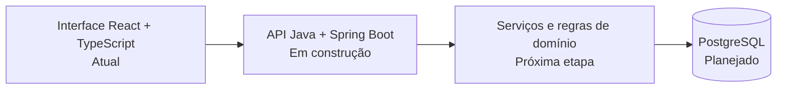

# ImobControl

[](https://github.com/luizamoll/imobcontrol-finance-dashboard/actions/workflows/backend-ci.yml)

Sistema web para controle financeiro de empreendimentos imobiliários, com foco no acompanhamento de vendas, parcelas, recebimentos, impostos, comissões e distribuição de repasses.

O projeto nasceu de uma necessidade real de organizar regras financeiras que ficam difíceis de acompanhar em planilhas conforme aumentam o número de empreendimentos, unidades e pagamentos.

> **Demonstração:** nomes, CNPJs, valores, compradores, empreendimentos e demais dados exibidos no projeto são fictícios e foram criados apenas para simular cenários de uso.

## Status

**Interface funcional · Back-end Java em evolução**

A aplicação web atual já concentra o fluxo financeiro e as regras de negócio de demonstração. A API em Java/Spring Boot foi iniciada e será evoluída por módulos, mantendo o projeto executável e compreensível em cada etapa.

## Funcionalidades atuais

- Dashboard com visão geral financeira
- Cadastro e acompanhamento de empreendimentos
- Controle de unidades e status de venda
- Registro de vendas e composição de pagamento
- Geração e acompanhamento de parcelas
- Registro de recebimentos
- Cálculo de imposto reservado
- Controle de comissão de corretagem
- Distribuição de valores entre empresa e sócio
- Acompanhamento de inadimplência
- Cadastro de recebedores
- Configurações de percentuais, juros, mora e tolerância
- Relatórios e acompanhamento financeiro

## Regras de negócio

O sistema trabalha com percentuais configuráveis por empreendimento e registra a distribuição financeira de cada recebimento.

No fluxo atual, um valor recebido pode ser separado em:

1. imposto reservado;
2. comissão aplicável;
3. saldo distribuído entre empresa e sócio conforme os percentuais do empreendimento.

Também existem configurações para correção, juros, mora, dias de tolerância e formas de pagamento.

## Tecnologias

### Interface atual

`TypeScript` · `React 19` · `TanStack Start` · `TanStack Router` · `TanStack Query` · `Vite` · `Tailwind CSS` · `Radix UI` · `React Hook Form` · `Zod` · `Recharts` · `Bun`

### Back-end em construção

`Java 21` · `Spring Boot 4.1` · `Spring Web` · `Bean Validation` · `Spring Boot Actuator` · `Maven`

O início da API está documentado em [`backend/README.md`](backend/README.md).

## Evolução da arquitetura



A migração está sendo feita gradualmente: primeiro a estrutura da API, depois persistência, regras financeiras no servidor e integração completa com a interface.

## Estrutura do repositório

```text
.
├── backend/       # API Java/Spring Boot em evolução
├── docs/          # arquitetura e roadmap técnico
└── src/           # aplicação web atual
    ├── components/
    ├── hooks/
    ├── lib/
    └── routes/
```

As entidades centrais incluem empreendimentos, unidades, vendas, parcelas, movimentos financeiros e configurações.

## Qualidade e automação

O back-end possui um workflow de **GitHub Actions** que executa os testes Maven em pull requests e alterações da `main` relacionadas à API.

A intenção é ampliar essa validação conforme surgirem regras de domínio, persistência e testes unitários específicos para os cálculos financeiros.

## Executando a interface

Requisito: Bun instalado.

```bash
bun install
bun run dev
```

Build de produção:

```bash
bun run build
```

Lint:

```bash
bun run lint
```

## Executando o back-end

Com Java 21 e Maven instalados:

```bash
cd backend
mvn spring-boot:run
```

Endpoints iniciais:

```text
GET /api
GET /actuator/health
```

## Documentação

- [Arquitetura e domínio](docs/ARQUITETURA.md)
- [Roadmap técnico](docs/ROADMAP.md)
- [Documentação do back-end](backend/README.md)

## Objetivo técnico

Além de resolver um problema de negócio, o ImobControl é usado para praticar modelagem de domínio, regras financeiras, organização de aplicações web, testes e evolução gradual para uma arquitetura full-stack com back-end Java.

---

**Maria Luiza Mol**  
Análise e Desenvolvimento de Sistemas · foco em Back-end Java
